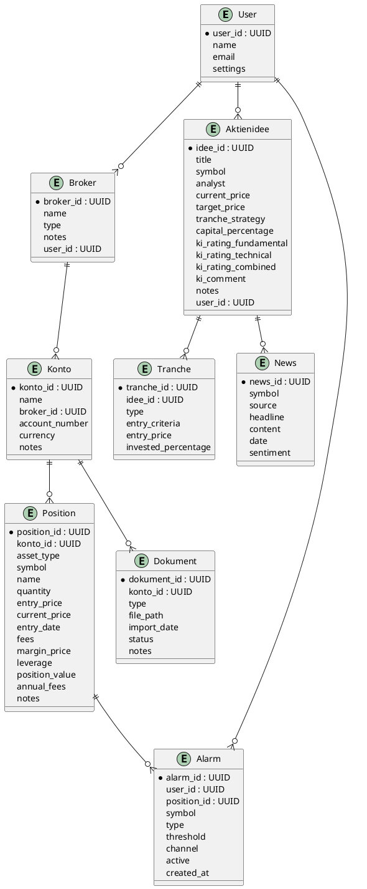

# ER-Diagramm (grafisch)

Das folgende Diagramm zeigt die wichtigsten Entitäten und deren Beziehungen im System. Die Darstellung ist im PlantUML-Format gehalten, sodass du sie direkt in Tools wie PlantUML, dbdiagram.io oder VS Code Extensions (z.B. "PlantUML Previewer") nutzen kannst.

> Tipp: Kopiere diesen PlantUML-Code in ein passendes Tool, um das ER-Diagramm grafisch zu visualisieren.
