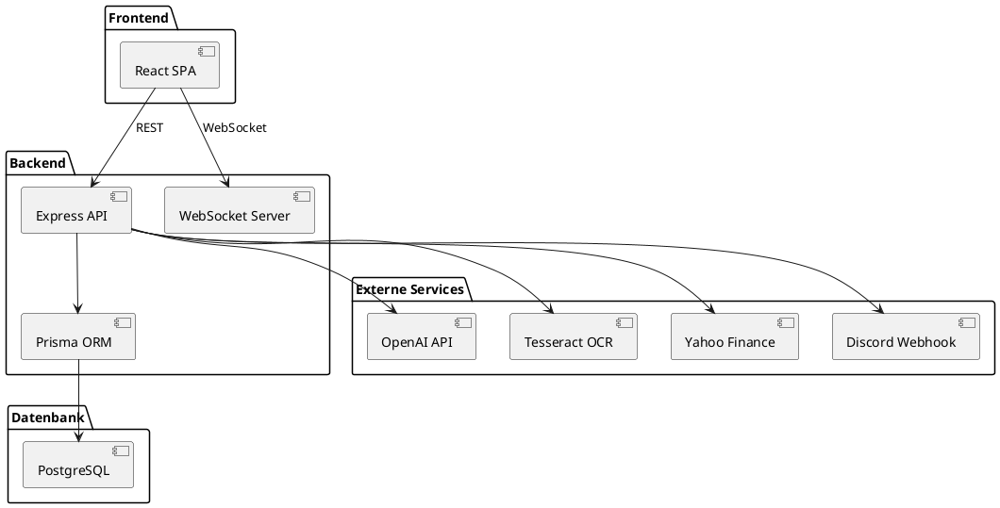

# Architekturentwurf für das Aktienmonitoring-Dashboard

## 1. Architekturübersicht

Die Architektur folgt einem modernen, modularen Ansatz mit klarer Trennung von Frontend, Backend, Datenbank und externen Services. Sie ist API-zentriert, skalierbar und für Cloud- wie On-Premises-Deployment geeignet.

```
+-------------------+        +-------------------+        +-------------------+
|    Frontend       | <----> |     Backend       | <----> |    Datenbank      |
| (React, Vite, MUI)|  REST  | (Node.js, Express)| Prisma |   (PostgreSQL)    |
+-------------------+        +-------------------+        +-------------------+
        |                          |  |         |\
        | WebSockets               |  |         | \
        v                          |  |         |  \
+-------------------+              |  |         |   +-------------------+
|   KI/OCR-Service  | <------------+  |         +---| Externe APIs      |
| (OpenAI, Tesseract|                 |             | (Yahoo, Discord,  |
|  oder Python)     |                 |             |  News, Broker)    |
+-------------------+                 |             +-------------------+
```

## 2. Hauptkomponenten

### Frontend (Single Page Application)
- React + Vite + MUI
- Kommuniziert ausschließlich über REST-API und WebSockets mit dem Backend
- Authentifizierung via JWT
- Darstellung von Dashboards, Charts, News, Portfolio, Alarme etc.

### Backend (API-Server)
- Node.js + Express + TypeScript
- REST-API für CRUD-Operationen (User, Portfolio, Positionen, Alarme, News, Dokumente, KI-Bewertung)
- WebSocket-Server für Echtzeitdaten (Kurse, Alarme)
- Anbindung an PostgreSQL via Prisma ORM
- Authentifizierung/Autorisierung (JWT)
- Schnittstellen zu externen Services (z.B. Yahoo Finance, Discord, OCR, KI)
- Microservice-fähig: KI/OCR kann als separater Service laufen

### Datenbank
- PostgreSQL, relationale Struktur gemäß Datenmodell
- Persistenz für alle Kernobjekte (User, Portfolio, Positionen, Alarme, News, Dokumente, Bewertungen)

### Externe Services
- KI-Service (OpenAI API oder eigener Python-Service via REST/gRPC)
- OCR-Service (Tesseract.js lokal, optional Cloud-OCR)
- Kurs-/News-/Broker-APIs (z.B. Yahoo Finance, Discord Webhooks)

## 3. Erweiterbarkeit & Skalierung
- Neue Features (z.B. weitere KI-Modelle, neue Assetklassen) als eigene Services/Module
- Skalierbar durch Containerisierung (Docker), Load Balancer, horizontale Skalierung
- API-first: Alle Funktionen über dokumentierte Schnittstellen

## 4. Sicherheit & Betrieb
- HTTPS, CORS, Rate Limiting, Input Validation
- Monitoring (Sentry, Prometheus), Logging (Winston/Pino)
- Secrets/Keys in .env oder Secret Stores
- Backup- und Migrationsstrategie für DB

## 5. Beispiel-Komponenten-Diagramm (PlantUML)



> Tipp: Kopiere das PlantUML-Diagramm in ein passendes Tool, um die Architektur grafisch darzustellen.

## 6. Schnittstellen & API-Design

- **REST-API:**
  - /api/users, /api/portfolio, /api/positions, /api/alarms, /api/news, /api/documents, /api/ki-evaluation
  - Authentifizierung: /api/auth/login, /api/auth/register
  - Standard-CRUD-Operationen (GET, POST, PUT, DELETE)
  - OpenAPI/Swagger-Dokumentation
- **WebSocket-Events:**
  - priceUpdate, alarmTriggered, newsUpdate, portfolioUpdate
  - Authentifizierung via JWT beim Verbindungsaufbau
- **Externe Services:**
  - Anbindung via REST/gRPC (KI, OCR, News, Kurse, Discord)

## 7. Deployment- & Infrastruktur-Architektur

- **Cloud-Deployment:**
  - Docker-Container für alle Services
  - Reverse Proxy (z.B. NGINX) für HTTPS, Routing, Load Balancing
  - CI/CD-Pipeline (z.B. GitHub Actions) für automatisiertes Build & Deployment
  - Monitoring- und Logging-Stack (Prometheus, Grafana, Sentry)
  - Backups und Disaster Recovery für Datenbank
- **Netzwerkdiagramm:**
  - Load Balancer → Reverse Proxy → Frontend/Backend → DB/Externe Services

## 8. Fehler- und Ausfallsicherheit

- Redundante Instanzen von Backend und DB (Cluster, Replica)
- Health Checks und automatische Neustarts (Docker, Orchestrator)
- Retry-Mechanismen und Circuit Breaker bei externen APIs
- Regelmäßige Backups und Restore-Tests

## 9. Security-Architektur

- JWT-basierte Authentifizierung und rollenbasierte Autorisierung
- HTTPS, CORS, Rate Limiting, Input Validation
- Verschlüsselung sensibler Daten (in DB und im Transit)
- Secrets/Keys in .env oder Secret Stores (z.B. Azure Key Vault)
- Logging von Security-Events und Audit-Log

## 10. Skalierungs- und Performance-Strategien

- Horizontale Skalierung von Backend und Frontend (Docker Swarm, Kubernetes)
- Caching (Redis) für häufige Abfragen und Sessions
- Queue-Systeme (z.B. für E-Mail/Alarm-Dispatch, asynchrone Tasks)
- Sharding/Partitionierung bei sehr großen Datenmengen

## 11. Service-Kommunikation & Integrationsmuster

- REST und WebSockets als Hauptprotokolle
- Microservices können via REST/gRPC oder Message Queue (z.B. RabbitMQ) kommunizieren
- Event Sourcing und Pub/Sub für asynchrone Updates (z.B. News, Alarme)

## 12. Monitoring, Logging & Alerting

- Sentry für Fehler- und Performance-Monitoring
- Prometheus/Grafana für Systemmetriken und Dashboards
- Winston/Pino für strukturiertes Logging im Backend
- Alerts bei Fehlern, Ausfällen, Performance-Problemen

## 13. Architekturentscheidungen & Begründungen

- API-zentrierte, modulare Architektur für maximale Flexibilität und Erweiterbarkeit
- Containerisierung für Portabilität und Skalierbarkeit
- Trennung von Zuständigkeiten (Frontend, Backend, KI/OCR, DB, externe Services)
- Fokus auf Security, Monitoring und Automatisierung
- Wahl bewährter, wartbarer Technologien mit großer Community

## 14. Change-Management & Erweiterbarkeit

- Neue Features als eigene Module/Services mit klaren Schnittstellen
- Versionierung der APIs (z.B. /api/v1/)
- Automatisierte Tests und CI/CD für sichere Integration
- Dokumentation aller Architekturentscheidungen und Änderungen

## 15. Non-Functional Requirements

- Hohe Verfügbarkeit (>99,5%)
- Geringe Latenz (<200ms für Kern-APIs)
- Datenschutz (DSGVO-Konformität, Datenminimierung)
- Wartbarkeit (Clean Code, Dokumentation, Modularität)
- Testbarkeit (Unit-, Integrations-, End-to-End-Tests)

## 16. Beispiel-Flows

### Beispiel: Alarm-Flow (Preis-Alarm)
1. Nutzer legt einen Preis-Alarm im Frontend an (/api/alarms, POST)
2. Backend speichert Alarm in DB und subscribed auf Kursdaten via WebSocket/API
3. Bei Kursänderung prüft Backend, ob Schwelle erreicht ist
4. Wenn ja: Alarm wird ausgelöst, Benachrichtigung via Discord/In-App/WebSocket
5. Alarm-Status wird aktualisiert (z.B. als "ausgelöst" markiert)

### Beispiel: Dokumentenimport-Flow
1. Nutzer lädt PDF/CSV im Frontend hoch (/api/documents, POST)
2. Backend speichert Datei und stößt OCR/Parsing-Service an
3. Extrahierte Daten werden validiert und als Vorschau zurückgegeben
4. Nutzer bestätigt Import, Daten werden in Portfolio übernommen
5. Historie und Fehler werden protokolliert

## 17. Zustandsdiagramme (Beschreibung)

- **Alarm:**
  - Zustände: aktiv → ausgelöst → bestätigt/archiviert
  - Übergänge: Kurs erreicht Schwelle, Nutzer bestätigt Alarm
- **Dokumentenimport:**
  - Zustände: hochgeladen → verarbeitet → validiert → übernommen/abgelehnt
  - Übergänge: Parsing erfolgreich, Nutzer bestätigt, Fehler aufgetreten

## 18. Verantwortlichkeiten/Teamrollen

- **Frontend:** UI/UX, React-Komponenten, State-Management, API-Integration
- **Backend:** API-Design, Business-Logik, Datenbank, Auth, Schnittstellen
- **KI/OCR-Service:** Modellintegration, Datenaufbereitung, Schnittstellen
- **DevOps:** CI/CD, Monitoring, Infrastruktur, Security
- **QA:** Testplanung, Testautomatisierung, Usability-Tests

## 19. Roadmap für technische Schulden & Refactorings

- Regelmäßige Code-Reviews und Refactoring-Sprints
- Dokumentation von Workarounds und technischen Schulden in Issues
- Geplante Migrationen (z.B. neue KI-Modelle, bessere Caching-Strategien)
- Automatisierte Tests und Metriken zur Codequalität

---

Diese Architektur ist robust, flexibel und für moderne Finanzanwendungen bestens geeignet. Sie lässt sich lokal entwickeln und später einfach in der Cloud oder On-Premises betreiben.
